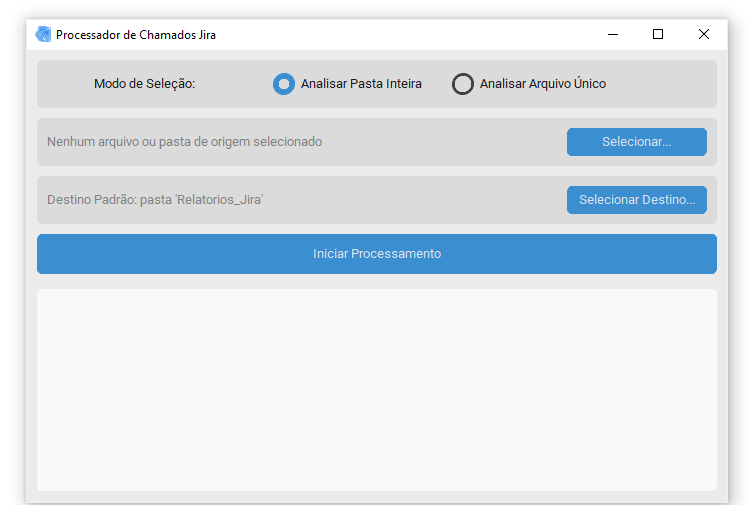

# Jira Ticket Analysis


Uma aplicação de desktop desenvolvida em Python com **CustomTkinter** para analisar exportações de **chamados do Jira em formato XML**, agregando dados por empresa e gerando relatórios individuais em planilhas Excel.

### Screenshot da Aplicação


## Índice

* [Sobre o Projeto](#sobre-o-projeto)
* [Principais Funcionalidades](#principais-funcionalidades)
* [Estrutura do Projeto](#estrutura-do-projeto)
* [Como Usar (Guia para o Usuário Final)](#como-usar-guia-para-o-usuário-final)
* [Guia para Desenvolvedores](#guia-para-desenvolvedores)
    * [Pré-requisitos](#pré-requisitos)
    * [Instalação das Dependências](#instalação-das-dependências)
    * [Executando a Aplicação](#executando-a-aplicação)
    * [Gerando o Executável e o Instalador](#gerando-o-executável-e-o-instalador)
* [Licença](#licença)

## Sobre o Projeto

Este projeto nasceu da necessidade de automatizar a análise quantitativa de chamados do Jira exportados em formato XML. A ferramenta oferece uma interface gráfica amigável que permite a um usuário, mesmo sem conhecimento técnico, processar múltiplos arquivos, agregar os dados com base em regras de negócio específicas (associação de chamados a empresas) e gerar relatórios individuais e organizados em formato Excel.

O objetivo é economizar tempo, reduzir erros manuais e fornecer insights rápidos sobre a carga de trabalho e o volume de chamados por cliente ou projeto.

## Principais Funcionalidades

* **Interface Gráfica Amigável:** Construída com CustomTkinter para uma aparência moderna e intuitiva.
* **Seleção Flexível de Dados:** Permite ao usuário analisar uma pasta inteira contendo múltiplos arquivos XML ou selecionar um único arquivo para processamento.
* **Destino de Saída Configurável:** O usuário pode escolher exatamente em qual pasta deseja salvar os relatórios gerados.
* **Processamento Assíncrono:** A análise dos arquivos ocorre em uma thread separada, garantindo que a interface do usuário nunca trave, mesmo com grandes volumes de dados.
* **Log de Atividades em Tempo Real:** Um painel de log exibe o progresso do processamento, informando ao usuário qual arquivo está sendo lido e o status da geração dos relatórios.
* **Geração de Relatórios em Excel:** Para cada empresa com chamados associados, um arquivo `.xlsx` é gerado, contendo informações detalhadas como título, data de criação, link e chamados vinculados.
* **Instalador Profissional:** O projeto final é distribuído como um `AnalisadorJira.exe`, criado com [Inno Setup](https://jrsoftware.org/isinfo.php), que permite uma instalação fácil e cria atalhos no sistema.

## Estrutura do Projeto

A organização dos arquivos foi pensada para separar as responsabilidades, facilitando a manutenção e futuras expansões.
```
ANALISE_JIRA/
├── main.py                # Ponto de entrada da aplicação, responsável por iniciar a interface.
├── core/
│   ├── apps/
│   │   └── home.py        # Contém a classe e toda a lógica da interface gráfica (GUI).
│   ├── assets/
│   │   └── icon_app.ico   # Ícone da aplicação.
│   └── data/
│       └── dataBase.py    # Módulo relacionado a dados (ex: a lista de CTOs).
├── services/
│   └── services.py        # Contém as funções de "negócio": análise do XML e geração das planilhas.
├── dist/                  # Pasta de saída do PyInstaller (contém o programa .exe).
├── Relatorios_Jira/       # Pasta padrão de saída dos relatórios Excel.
├── AnalisadorJira.spec    # Arquivo de configuração do PyInstaller.
└── README.md              # Este arquivo de documentação.
```

## Desenvolvedor:
Desenvolvido por [Gonçalves](https://www.linkedin.com/in/jgoncalvessf/) ☕